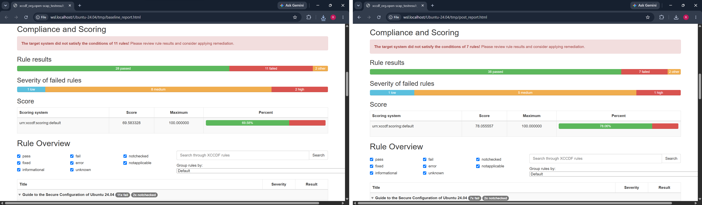
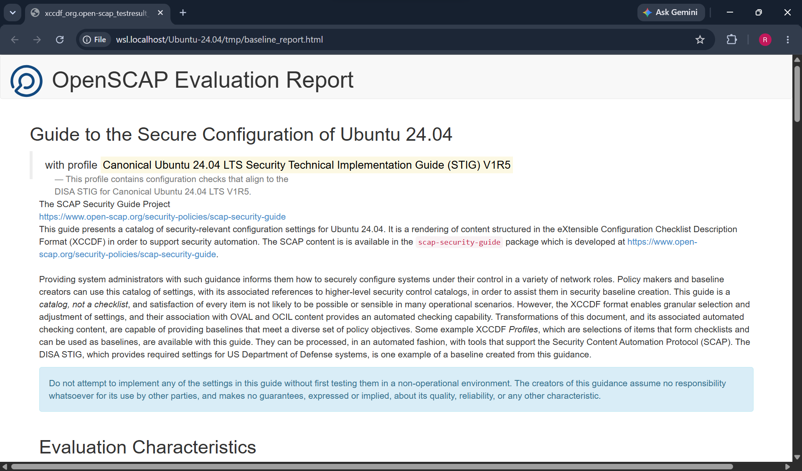
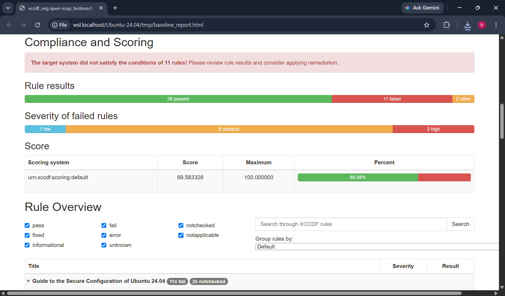
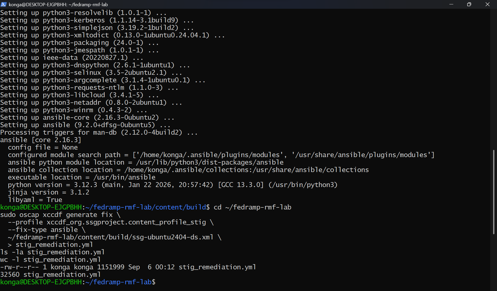
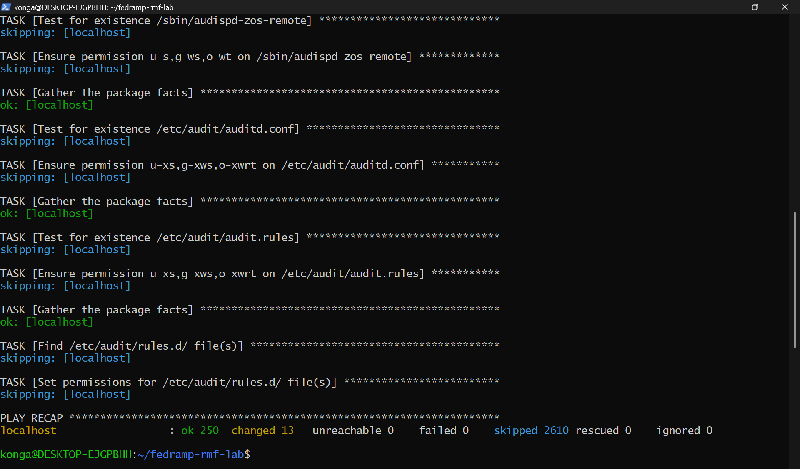

# FedRAMP RMF Compliance Lab

A hands-on Risk Management Framework (RMF) lab that carries a single Ubuntu 24.04 LTS
host through a full FedRAMP Moderate authorization cycle: baseline assessment with
OpenSCAP against the Canonical Ubuntu 24.04 LTS STIG V1R5 benchmark, automated
remediation with Ansible, reassessment to measure the delta, and a documentation package
covering the residual risk that remains. Every number in this repository comes from scans
run against the lab host, and every finding traces back to a DISA STIG rule ID from the
benchmark.

## Architecture

The lab produces three deliverables.

**Hardened Ubuntu 24.04 LTS host.** A single Ubuntu 24.04 LTS server running as a WSL2
instance, used as the assessment target. The system boundary is the operating system and
its installed packages; no network-facing application, database, or externally reachable
service runs on the host. The host is scanned with OpenSCAP against the STIG profile,
remediated with the generated Ansible playbook, then rescanned with the identical profile
and datastream to isolate the effect of remediation.

**RMF documentation package.** The artifacts an assessor would expect to receive
alongside the system: an SSP summary, a POA&M, a FedRAMP Moderate control matrix, a
three-framework crosswalk, and the remediation playbook itself. Each document is built
from the scan output rather than from a template, so the SSP, the POA&M, and the OpenSCAP
reports carry the same numbers.

**SOX/COSO access certification.** The access review side of the control environment,
which sits outside the technical STIG scope but inside the same governance story: an
access review of 15 simulated users across 3 systems with per-user business justification
and certifier action, a mapping of the review to COSO components, a separation of duties
matrix, and a sign-off log.

## Tools and Frameworks

| Tool or framework | Version or scope | Role in the lab |
|---|---|---|
| Ubuntu Server LTS | 24.04 (WSL2) | Assessment target host |
| OpenSCAP (`oscap`) | 1.3.9 | SCAP scanning, HTML report generation, Ansible fix generation |
| ComplianceAsCode / SCAP Security Guide | 0.1.83 | Source of the `ssg-ubuntu2404-ds.xml` datastream |
| DISA STIG for Canonical Ubuntu 24.04 LTS | V1R5 | Hardening benchmark and scanned profile |
| Ansible | `ansible-playbook`, local connection | Applied the generated remediation to the host |
| NIST SP 800-53 | Rev 5 | Control catalog behind the SSP and control matrix |
| NIST RMF (SP 800-37) | Rev 2 | Process framework: categorize, select, implement, assess, authorize, monitor |
| FIPS 199 | Current | System categorization methodology |
| FedRAMP | Moderate baseline | Control baseline and inheritance model |
| CIS Ubuntu Linux Benchmark | 24.04 LTS | Third framework in the crosswalk |
| COSO Internal Control Framework | 2013 | Component mapping for the access certification |
| Sarbanes-Oxley (SOX) | Section 404 context | Driver for periodic access review and sign-off |

### Platform note: Ubuntu 22.04 to 24.04

This lab originally targeted Ubuntu 22.04 LTS (jammy). It was switched to Ubuntu 24.04 LTS
during environment setup because `openscap-scanner` and `scap-security-guide` are not
installable on jammy: the package metadata references them, but the binaries were
never published to the official archive, so the install resolves and then fails to fetch.

Ubuntu 24.04 was used instead, since both packages are available natively there. The SCAP
content was then built directly from the ComplianceAsCode/content GitHub source for the
`ubuntu2404` product rather than relying on pre-packaged content, which lags the upstream
STIG benchmark. This is the reason the benchmark version in use (SCAP Security Guide
0.1.83, STIG V1R5) is known exactly.

## Results

| Metric | Baseline | Post-hardening | Delta |
|---|---|---|---|
| Rules passed | 28 | 38 | +10 |
| Rules failed | 11 | 7 | -4 |
| Not checked | 2 | 2 | 0 |
| Compliance score | 69.58% | 78.06% | +8.48 points |



*Baseline versus post-hardening OpenSCAP results, 69.58% to 78.06%.*

The columns do not sum to the same total (41 rules at baseline, 47 after). The figures
are the pass, fail and "other" counts from the OpenSCAP report summary bar (see the
screenshots), and that bar leaves out rules in other result states such as not applicable. Both scans used the same profile and datastream, so the 6 extra rules in the
post-hardening counts were evaluated at baseline too, in a state the bar does not count.
The per-rule results files were not committed, so the exact baseline state of those 6
rules is not recorded here.

The Ansible remediation run applied **13 configuration changes with 0 failures**, covering
audit subsystem configuration, privilege escalation re-authentication, SSSD credential
handling, audit log permissions, and kernel module load auditing.

The **7 findings that remain open** are tracked in `POAM.xlsx` with their DISA STIG
rule IDs, risk levels, responsible party, and target completion dates. They split into
findings that are inherent to the lab environment and cannot be remediated here, and
findings that require a configuration decision beyond the scope of an unattended
remediation run. See the notes at the end of this README for the breakdown.

## Repository Structure

```
fedramp-rmf-lab/
├── SSP_Summary.md                 System Security Plan summary
├── POAM.xlsx                      Plan of Action and Milestones, 7 open findings
├── FedRAMP_Control_Matrix.xlsx    52 NIST 800-53 Rev 5 Moderate controls, 20 families
├── CIS_STIG_NIST_Crosswalk.md     10 controls mapped across CIS, STIG, and NIST
├── Access_Certification.xlsx      SOX/COSO user access certification
├── stig_remediation.yml           OpenSCAP-generated Ansible remediation playbook
└── screenshots/
    ├── openscap_baseline_report.png
    ├── openscap_baseline_summary.png
    ├── ansible_playbook_generated.png
    ├── ansible_hardening_run.png
    ├── openscap_post_report.png
    └── openscap_delta_comparison.png
```

| Artifact | Contents |
|---|---|
| `SSP_Summary.md` | System description and boundary, FIPS 199 categorization, control family implementation status, FedRAMP control inheritance table |
| `POAM.xlsx` | Open findings with STIG IDs, risk levels, responsible party, and target completion dates, plus a notes worksheet |
| `FedRAMP_Control_Matrix.xlsx` | Control-by-control FedRAMP Moderate mapping with status, inherited versus customer responsibility, and STIG rule mapping |
| `CIS_STIG_NIST_Crosswalk.md` | Ten representative controls carrying CIS, DISA STIG, and NIST 800-53 references in the same rule definition |
| `Access_Certification.xlsx` | Access review, COSO mapping, separation of duties matrix, and sign-off log |
| `stig_remediation.yml` | The Ansible playbook generated from the STIG profile and applied to the host |

The ComplianceAsCode `content/` build tree is excluded from version control. It is the
upstream build source, not a deliverable, and is reproducible from the ComplianceAsCode
repository.

## Reproducing the Assessment

Build the SCAP content for the `ubuntu2404` product from ComplianceAsCode source:

```bash
git clone https://github.com/ComplianceAsCode/content.git
cd content && ./build_product ubuntu2404
```

Run the baseline scan against the unhardened host:

```bash
sudo oscap xccdf eval \
  --profile xccdf_org.ssgproject.content_profile_stig \
  --results baseline-results.xml \
  --report baseline-report.html \
  content/build/ssg-ubuntu2404-ds.xml
```

Generate the Ansible remediation playbook from the same profile:

```bash
oscap xccdf generate fix \
  --profile xccdf_org.ssgproject.content_profile_stig \
  --fix-type ansible \
  content/build/ssg-ubuntu2404-ds.xml > stig_remediation.yml
```

Apply the playbook to the local host:

```bash
ansible-playbook -i "localhost," -c local stig_remediation.yml
```

Rescan with the identical profile and datastream, so the difference between the two runs
reflects the remediation and nothing else:

```bash
sudo oscap xccdf eval \
  --profile xccdf_org.ssgproject.content_profile_stig \
  --results post-results.xml \
  --report post-report.html \
  content/build/ssg-ubuntu2404-ds.xml
```

Review the generated tasks before applying them. The playbook attempts to fix every rule
selected by the profile regardless of the host's current state, and some tasks restart
services.

## Screenshots

### 1. Baseline assessment



Full OpenSCAP HTML report for the baseline scan, showing per-rule pass and fail status
against the Ubuntu 24.04 STIG V1R5 profile before any hardening.



Baseline scan result summary, 28 passed and 11 failed, for a compliance score of 69.58%.

### 2. Remediation



The remediation playbook generated from the STIG profile by `oscap xccdf generate fix`,
saved as `stig_remediation.yml`.



The `ansible-playbook` run against the lab host, applying 13 configuration changes with
0 failures.

### 3. Reassessment


Full OpenSCAP HTML report for the post-remediation scan, run with the identical profile
and datastream.


Side-by-side comparison of the baseline and post-hardening results, 69.58% to 78.06%,
with 10 additional rules passing and 4 fewer failing.

## Authorization

Everything ran against a WSL2 instance on my own machine. No other system was scanned or
touched, and the lab host runs no network-facing service. The access certification data is
synthetic and does not describe real users or production entitlements.

## Notes on POA&M and SSP Structure

### POA&M

`POAM.xlsx` has two worksheets, `POAM` and `Notes`. The POA&M sheet carries one row per
open finding with the columns POA&M ID, Control ID, Weakness, Risk Level, Responsible
Party, Completion Date, and Status. Control IDs are the DISA STIG rule IDs from the scan,
so each row traces back to a specific line in the OpenSCAP report.

The 7 findings that remain open after remediation fall into two categories:

- **Environment-inherent findings**, which cannot be remediated in this lab and are
  documented as accepted risk with rationale. POA-001 (UBTU-24-600090, filesystem
  encryption at rest) is the clearest example: WSL2 does not support block-level disk
  encryption, so the finding is recorded, risk-rated, and assigned rather than silently
  dropped.
- **Findings requiring configuration decisions** beyond the scope of an unattended
  remediation run, such as SSH client cipher restrictions (UBTU-24-100850) and SSSD
  certificate trust configuration (UBTU-24-400360, UBTU-24-400370).

Risk levels follow the severity assigned by the STIG benchmark rather than being set by
hand, and target completion dates are forward-looking.

### SSP

`SSP_Summary.md` is structured as a condensed FedRAMP SSP body: system name, system
description and boundary, FIPS 199 categorization with per-objective rationale, control
family implementation status across all 20 NIST SP 800-53 Rev 5 families, a FedRAMP control
inheritance table, and a summary of assessment results.

The SSP makes two structural choices:

- Implementation status uses three values, Implemented, Partially Implemented, and Not
  Applicable, and each is tied to evidence. "Partially Implemented" always means an open
  POA&M item exists in that family, so the SSP and the POA&M cannot drift apart.
- Inheritance claims are deliberately conservative. Since this host does not run on a
  FedRAMP-authorized cloud platform, the inheritance table describes what would be
  inherited in a production CSP deployment and marks everything else as customer
  responsibility, rather than asserting inheritance the lab cannot demonstrate.
